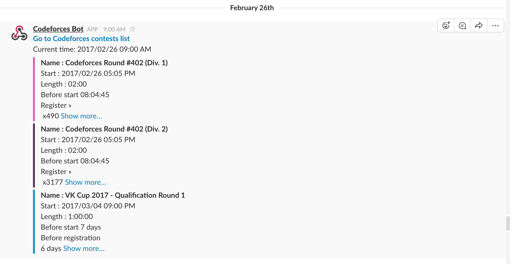

# AlgoContestSlackBot


Notify algorithm contest schedules to slack channel.
(Currently, it notifies Codeforces contest schedule to Slack channel.)


## How to run
This Slack bot runs in AWS Lambda.
To test the bot, you should configure your own hookUrl, channelName in test.py or app.py

Configure hookUrl, channelName in test.py and run the following command in the terminal.
```sh
python test.py
```

The alternative way to test is running chalice on the local environment.
Install chalice and http with the following link: https://github.com/awslabs/chalice

In MAC, write following commands to the terminal to test if the function works correctly.
(Remember to configure hookUrl, channelName in app.py!)
```sh
chalice local
http localhost:8000/local 
```

If you get {"ok": "yes"}, it means that it works correctly.

## Result

